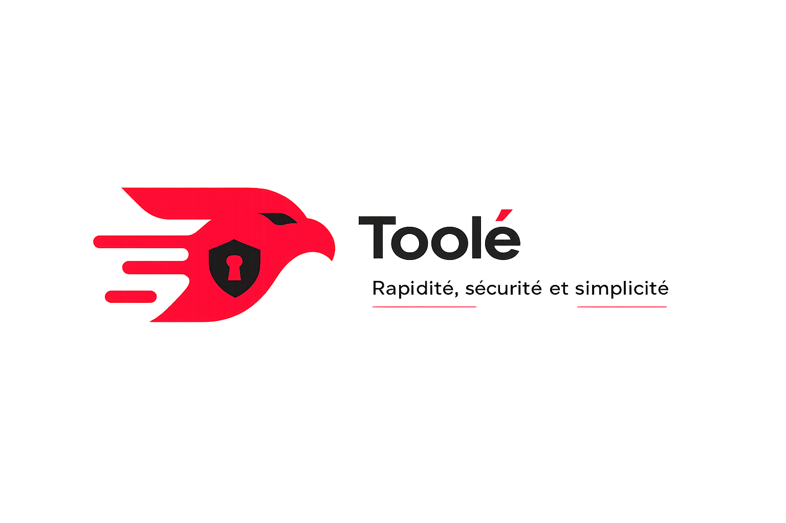

# Toolé

**Transfert de fichiers P2P en réseau local, sans Internet.**

Toolé est une application open source de transfert de fichiers pair-à-pair (P2P) fonctionnant entièrement sur réseau local, sans Internet.

Le projet permet à plusieurs appareils présents sur le même réseau de se découvrir automatiquement, de communiquer directement, d'échanger des fichiers de manière sécurisée, de vérifier l'intégrité des données, et d'envoyer des fichiers à plusieurs utilisateurs simultanément.

---

## Fonctionnalités

- Découverte automatique des appareils sur le LAN via UDP broadcast
- Mode **Send** : devient hôte, diffuse sa présence, envoie à plusieurs receveurs simultanément
- Mode **Receive** : écoute les annonces, détecte les appareils, choisit un sender
- Transfert sécurisé via **TLS** avec chiffrement bout-en-bout
- Vérification d'intégrité : **CRC32** par chunk + **SHA-256** fichier final
- Streaming mémoire optimisé : pas de chargement complet en RAM

---

## Stack technologique

| Domaine | Technologie |
|---|---|
| Langage backend | Rust |
| Runtime async | Tokio |
| Interface desktop | Tauri |
| Frontend | React + TypeScript |
| Découverte réseau | UDP Broadcast (Tokio net) |
| Transfert fichiers | TCP (Tokio net) |
| Sécurité | rustls (TLS 1.3) |
| Hash SHA-256 | sha2 |
| CRC32 | crc32fast |
| Sérialisation | serde + serde_json |
| Buffers | bytes |
| UUID | uuid |
| Logging | tracing |

---

## Prérequis

- [Rust](https://www.rust-lang.org) — `curl --proto '=https' --tlsv1.2 -sSf https://sh.rustup.rs | sh`
- [Node.js](https://nodejs.org)
- [Tauri](https://tauri.app)

## Documentation

| Document | Description |
|---|---|
| [ARCHITECTURE.md](docs/ARCHITECTURE.md) | Architecture technique complète |
| [PROTOCOL.md](docs/PROTOCOL.md) | Protocole réseau détaillé |
| [SECURITY.md](docs/SECURITY.md) | Sécurité, TLS, vérification d'intégrité |
| [ROADMAP.md](docs/ROADMAP.md) | Roadmap de développement |
| [CONTRIBUTING.md](CONTRIBUTING.md) | Guide de contribution |

---

## Licence

[MIT](LICENSE)
