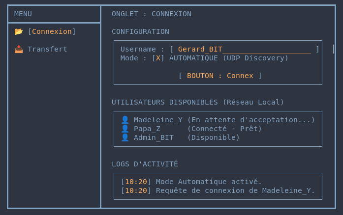
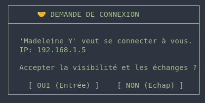
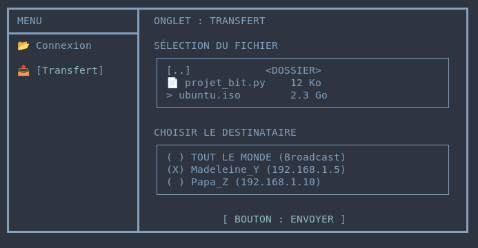

<<<<<<< HEAD
# Software Requirement Specifications (SRS)
## Introduction
>Toolé est un programme TUI permettant de transfere des fichiers de maniere securisé entre deux ordinateurs en utilisant le reseau wifi en mode P2P (Peer to peer),elle se veut le plus simple d'utilisation possible pour l'utilisation par tous.[En savoir plus](brouillon.md)

## Description general du systeme

### Contraintes de conception:
- Le language C
- Les OS linux et Windows
- Version minimale avec un TUI fonctionnel
- chifrement des données pendant le transfert pour eviter le Man-in-the-Middle

## Exigences fonctionnelles

### Appairage à proximité [F-001](PRD.md#linventaire-des-fonctionnalités)

- E-001: Le system doit envoyer chaque 1000ms un beacon contenant: l'IP,le port pour le TCP,le message Auto
- E-002: Le message auto doit etre optionnel et c'est l'utilisateur qui l'active
- E-003: Le systeme doit ecouté permennament sur un port specifique
- E-004: Si un appareil a deja un client en tant que serveur TCP, tout autre appareil qui vient à lui doit automatiquement etre client

### Transfere de fichiers sécurisé [F-002](PRD.md#linventaire-des-fonctionnalités)

- E-005: Toute demaande de connexion doit etre d'abord accepté qu'elle soit automatique ou pas.
- E-006: La connexion par TCP doit se fait par autodeterminisme pour savoir qui sera serveur et qui sera client (serveur:IP superieur,client:IP inferieur)
- E-007: Le systeme doit utiliser le Zero-copy pour le transfere de fichier  

### Une interface TUI (Text-based User Interface) [F-003](PRD.md#linventaire-des-fonctionnalités)

- E-008: Le Tui doit presenter une barre de progresion pendant le transfere de fichier

## Exigences non fonctionnelles
 - La decouverte UDP doit etre rapide 
 - Le transfere de fichier doit etre tres rapide

## Interface externe

>
>
>
>

---
>[Achitecture et schemas](diagram.md)
=======
# Software Requirement Specifications (SRS)

Hello le BOP, ici on pose les exigences logicielles détaillées de Toolé.

## 1) Introduction

Toolé est un système P2P local qui permet de transférer des fichiers entre ordinateurs, avec découverte automatique, contrôle TCP et reprise après panne Master.

> Contexte produit: [PRD.md](PRD.md)  
> Vision initiale: [brouillon.md](brouillon.md)

## 2) Description générale du système

### Contraintes de conception

- Cœur réseau en **C**.
- Cible OS: **Linux** (priorité actuelle), puis Windows.
- Discovery en UDP, contrôle et transfert en TCP.
- Architecture cluster: 1 Master logique + clients.

## 3) Exigences fonctionnelles

### Appairage et discovery (F-001)

- **E-001**: Le système envoie périodiquement un beacon UDP.
- **E-002**: Le beacon contient `id`, `username`, `ip`, `tcp_port`, `role`, `cluster_id`, `master_ip`, `master_port`.
- **E-003**: Le système écoute en continu les beacons sur le port de discovery.
- **E-004**: Les nœuds non vus depuis un délai défini sont retirés de la liste active.

### Contrôle cluster et failover (F-002)

- **E-005**: Le client envoie un `HELLO` à l’établissement du lien TCP.
- **E-006**: Le client envoie des `HEARTBEAT` pour signaler sa présence.
- **E-007**: En cas de perte Master (timeout/fermeture), le client passe en état `ELECTION`.
- **E-008**: L’élection suit une règle déterministe (plus petit `id` gagnant).
- **E-009**: Le gagnant devient `MASTER`, les autres se reconnectent.
- **E-010**: Si connexion directe impossible, un nœud peut récupérer le Master via voisin (`RELAY_REQUEST/RELAY_RESPONSE`).

### Transfert de fichier (F-002)

- **E-011**: Le système envoie une metadata (`nom`, `taille`) avant le flux.
- **E-012**: Le récepteur reconstruit le fichier avec vérification de taille attendue.

### Interface opérable (F-003)

- **E-013**: L’interface expose la connexion, les pairs disponibles et l’envoi.
- **E-014**: L’utilisateur reçoit des retours explicites sur le statut transfert.

## 4) Exigences non fonctionnelles

- Discovery rapide et stable.
- Contrats réseau lisibles (`network.h`, `server_runtime.h`, `file_transfert.h`).
- Gestion d’erreur explicite côté sockets/fichiers.
- Compatibilité d’évolution vers une liaison propre entre coeur C (`app.c/main.c`) et UI Python.

## 5) Interface externe (maquettes)

---

>[Architecture et schemas](diagram.md)  
>[Architecture technique detaillee](architecture.md)  
>>>>>>> 4f2ec6ce32eb8f8092ad46be7fd76220b4f353dd
